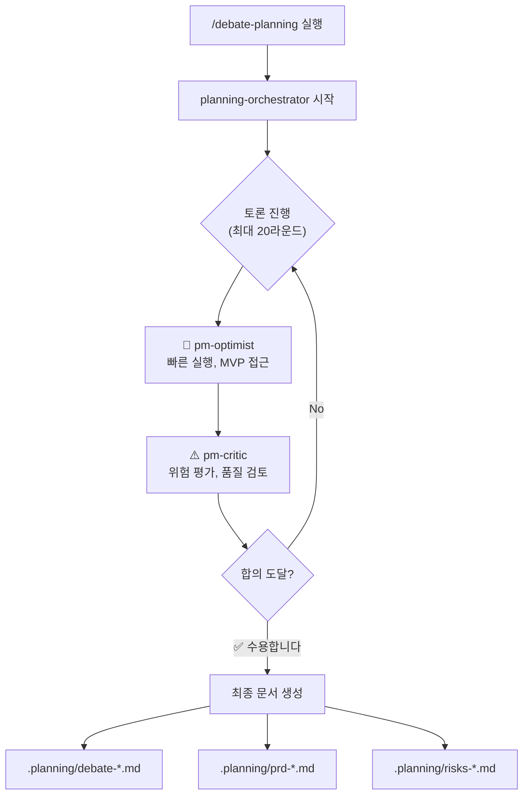

# Claude Debate Planning

두 PM 에이전트(낙관적 PM vs 비판적 PM)가 토론하여 균형 잡힌 플래닝을 생성하는 Claude Code 설정입니다.

## 개요

프로젝트 플래닝 시 한쪽 관점에 치우치지 않도록, 서로 다른 성향의 두 PM 에이전트가 토론을 통해 최적의 계획을 도출합니다.

| 에이전트 | 역할 |
|---------|------|
| **pm-optimist** | 속도, MVP, 빠른 실행을 옹호하는 낙관적 PM |
| **pm-critic** | 위험 관리, 기술 부채, 확장성을 고려하는 비판적 PM |
| **planning-orchestrator** | 토론을 조율하고 최종 PRD를 작성하는 조율자 |

## 설치

### macOS / Linux

```bash
git clone https://github.com/kimtami/claude-debate-planning.git
cd claude-debate-planning
./install.sh
```

### Windows (PowerShell)

```powershell
git clone https://github.com/kimtami/claude-debate-planning.git
cd claude-debate-planning
.\install.ps1
```

### 수동 설치

`~/.claude/` 디렉토리에 파일들을 직접 복사합니다:

```bash
cp agents/*.md ~/.claude/agents/
cp commands/*.md ~/.claude/commands/
cp hooks/* ~/.claude/hooks/
cp hooks.json ~/.claude/
```

## 사용법

Claude Code에서 다음 명령어를 실행합니다:

```
/debate-planning [플래닝 요청 내용]
```

### 예시

```
/debate-planning 우리 서비스에 AI 챗봇 기능을 추가하고 싶습니다.
고객 지원 자동화가 목표이고, 3개월 내 출시를 원합니다.
```

## 워크플로우



## 출력 파일

토론 결과물은 **현재 작업 디렉토리**의 `.planning/` 폴더에 저장됩니다:

- `debate-*.md` - 전체 토론 기록
- `prd-*.md` - 최종 PRD
- `risks-*.md` - 위험 레지스터

## 파일 구조

```
.
├── README.md
├── install.sh          # macOS/Linux 설치 스크립트
├── install.ps1         # Windows 설치 스크립트
├── agents/
│   ├── pm-optimist.md      # 낙관적 PM 에이전트
│   ├── pm-critic.md        # 비판적 PM 에이전트
│   └── planning-orchestrator.md  # 토론 조율자
├── commands/
│   └── debate-planning.md  # /debate-planning 명령어
├── hooks/
│   └── log-debate.py       # 토론 내용 자동 로깅
└── hooks.json              # 훅 설정
```

## 라이선스

MIT
